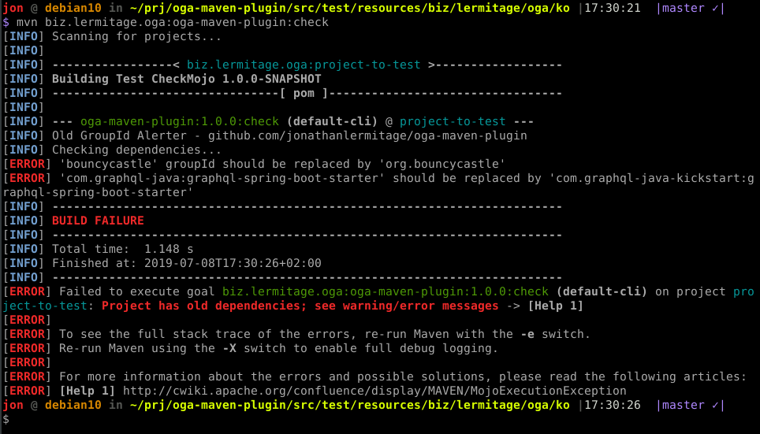

<h1 align="center">
    Old GroupIds Alerter - Maven Plugin
</h1>

<p align="center">
    <a href="https://github.com/jonathanlermitage/oga-maven-plugin/blob/master/LICENSE.txt"></a>
    <a href="https://search.maven.org/artifact/biz.lermitage.oga/oga-maven-plugin"></a>
</p>

A Maven plugin that checks for deprecated *groupId + artifactId* couples, in order to reduce usage of non-maintained 3rd-party code (e.g. did you know that artifact `graphql-spring-boot-starter` moved from `from com.graphql-java` to `com.graphql-java-kickstart`?).

Works with Maven 3.3+ and JDK8+.

*Looking for a Gradle plugin? Check [oga-gradle-plugin](https://github.com/jonathanlermitage/oga-gradle-plugin).*

## Author

Jonathan Lermitage (<jonathan.lermitage@gmail.com>)  
Linkedin profile: [jonathan-lermitage-092711142](https://www.linkedin.com/in/jonathan-lermitage-092711142/)

## Usage

### Goal

There's one maven goal: `biz.lermitage.oga:oga-maven-plugin:check`.

Execution will produce error  message everytime a deprecated *groupId + artifactId* couple is found.  
You may see something like `[ERROR] 'com.graphql-java:graphql-spring-boot-starter' should be replaced by 'com.graphql-java-kickstart:graphql-spring-boot-starter'`, and Maven build failure.



### Maven coordinates

Maven coordinates ([Nexus](https://oss.sonatype.org/#nexus-search;quick~oga-maven-plugin)):

```xml
<groupId>biz.lermitage.oga</groupId>
<artifactId>oga-maven-plugin</artifactId>
<version>1.7.0</version>
```

### Configuration

The following properties can be set on the `oga-maven-plugin` plugin.

| Maven Configuration Property | Command Line Property (if different) | Description                                                                                                                                                                                                                               | Default Value                                                                                                 |
|:-----------------------------|:-------------------------------------|:------------------------------------------------------------------------------------------------------------------------------------------------------------------------------------------------------------------------------------------|:--------------------------------------------------------------------------------------------------------------|
| ogDefinitionsUrl             |                                      | Alternative location for og-definitions.json config file.<br/>The configuration value can be a local file path, or a URL.                                                                                                                 | https://raw.githubusercontent.com/jonathanlermitage/oga-maven-plugin/master/uc/og-definitions.json            |
| ogUnofficialDefinitionsUrl   |                                      | Alternative location for og-unofficial-definitions.json config file.<br/>The configuration value can be a local file path, or a URL.                                                                                                      | https://raw.githubusercontent.com/jonathanlermitage/oga-maven-plugin/master/uc/og-unofficial-definitions.json |
| additionalDefinitionFiles    |                                      | A list of locations for additional json config files which are processed in addition to those in the definitions at `ogDefinitionsUrl` and `ogUnofficialDefinitionsUrl`.<br/>The configuration values can be a local file path, or a URL. |                                                                                                               |
| ignoreListFile               |                                      | Local file location of a JSON ignore-list in order to exclude some *groupIds* or *groupId + artifactIds*.                                                                                                                                 |                                                                                                               |
| ignoreListUrl                |                                      | Remote file location of a JSON ignore-list in order to exclude some *groupIds* or *groupId + artifactIds* (ignored if `ignoreListFile` is defined).                                                                                       |                                                                                                               |
| ignoreUnofficialMigrations   |                                      | Ignore unofficial definitions loaded from `ogUnofficialDefinitionsUrl`.                                                                                                                                                                   | `false`                                                                                                       |
| failOnError                  |                                      | Fail on error, otherwise display an error message only.                                                                                                                                                                                   | `true`                                                                                                        |
| skip                         | oga.maven.skip                       | Skip Check, for use in multi branch pipeline or command line override.                                                                                                                                                                    | `false`                                                                                                       |


#### Failing the build

By default, your build will fail if you use this plugin, if you would like to receive a warning instead you can set the `failOnError` property like so:
```xml
<plugin>
    <groupId>biz.lermitage.oga</groupId>
    <artifactId>oga-maven-plugin</artifactId>
    <configuration>
        <failOnError>false</failOnError>
    </configuration>
</plugin>
```

#### Changing the definitions

By default, this plugin is configured to use the [community maintained definitions files](https://github.com/jonathanlermitage/oga-maven-plugin/tree/master/uc) in 
this repository. `og-definitions.json` defines official migration plans. `og-unofficial-definitions.json` defines unofficial migration plans for abandoned dependencies with no official successors (active forks are proposed instead).

If you would like to use **only** your own definitions you can override the location of the file:
```xml
<plugin>
    <groupId>biz.lermitage.oga</groupId>
    <artifactId>oga-maven-plugin</artifactId>
    <configuration>
        <ogDefinitionsUrl>https://your-custom-location/your-og-definitions.json</ogDefinitionsUrl>
    </configuration>
</plugin>
```

Your custom definitions file can mix official and unofficial migrations. See the structure of `og-definitions.json` and `og-unofficial-definitions.json` files for details.

However, if you would like to get the benefit of the community maintained definitions **and** maintain your own definitions you can define additional files:
```xml
<plugin>
    <groupId>biz.lermitage.oga</groupId>
    <artifactId>oga-maven-plugin</artifactId>
    <configuration>
        <additionalDefinitionFiles>
            <!-- A Remote Location -->
            <additionalDefinitionFile>https://your-custom-location/your-og-definitions.json</additionalDefinitionFile>
            <!-- A local file -->
            <additionalDefinitionFile>./your-og-definitions.json</additionalDefinitionFile>
            <!-- Multiple entries supported -->
        </additionalDefinitionFiles>
    </configuration>
</plugin>
```

#### Ignoring definitions

You can also provide a JSON ignore-list in order to exclude some *groupIds* or *groupId + artifactIds*:
```xml
<plugin>
    <groupId>biz.lermitage.oga</groupId>
    <artifactId>oga-maven-plugin</artifactId>
    <configuration>
        <ignoreListFile>local-ignore-list.json</ignoreListFile>
        <!-- or -->
        <ignoreListUrl>https://website.com/remote-ignore-list.json</ignoreListUrl>
    </configuration>
</plugin>
```
Please see the sample [ignore-list file](sample/sample_ignore_list.json). For each of your dependencies or proposed migrations, the plugin will ignore it if it finds its coordinates in the ignore-list. So, by ignoring "foo:bar" (or "foo"), you will ignore this coordinate from your project dependencies and from the definitions file.

You can skip check (useful in multi-branch pipeline) by using the `oga.maven.skip` property.

Finally, you can also set configuration in command line with `-DogDefinitionsUrl`, `-DignoreListFile`, `-DignoreListUrl`, `-DfailOnError`, `-Doga.maven.skip` properties.

## Build

Just call `./mvnw clean install` or `./do i` to build plugin and install into local Maven repository.  

## Contribution

### Code 

Open an issue or a pull-request. Contributions must be tested at least on JDK8.  
Please reformat new code only: do not reformat the whole project or entire existing file (in other words, try do limit the amount of changes in order to speed up code review).

### Definitions file

The list of deprecated *groupId + artifactId* couples is stored in [og-definitions.json](uc/og-definitions.json) file. To remove/update/add entries, you can open an issue, submit a merge request, or simply send an email (<jonathan.lermitage@gmail.com>).  

### Find new entries for definitions file

Go to [maven-index-search-suspect-coordinates](maven-index-search-suspect-coordinates/): this project downloads Maven Central indexes and looks for potential entries, then saves it to a file; i.e. artifactIds that exists for two different groupIds (keep in mind that 90~99% are false-positive).  
You can view resulting file here: [suspiciousCoordinates.txt](maven-index-search-suspect-coordinates/suspiciousCoordinates.txt) (warning, it's a ~3 MB file).  
A filtered version is available here: [suspiciousCoordinates-filtered.txt](maven-index-search-suspect-coordinates/suspiciousCoordinates-filtered.txt) (~500 KB). In this file, we keep only dependency couples where a groupId is a part of the other groupdId, like `com.graphql-java` and `com.graphql-java-kickstart`.

## License

MIT License. In other words, you can do what you want: this project is entirely OpenSource, Free and Gratis.
